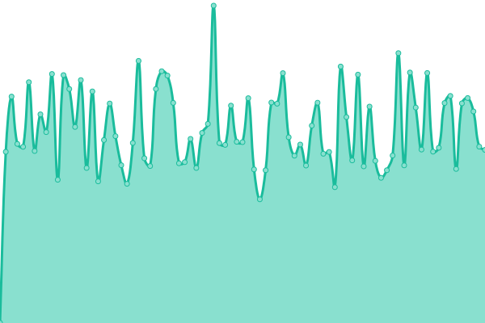
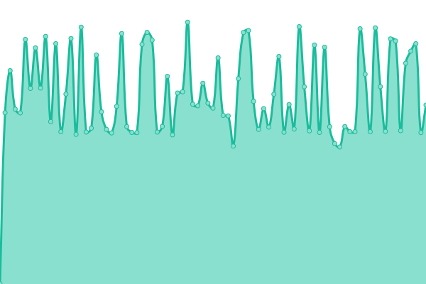
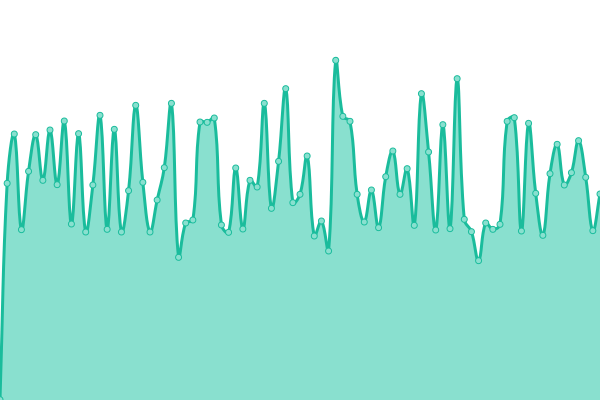
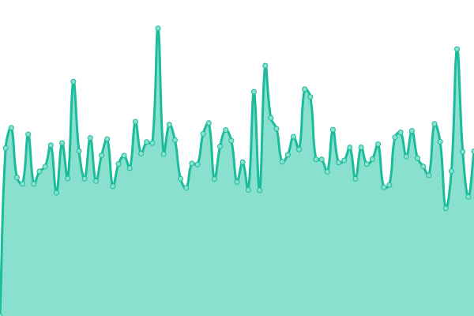
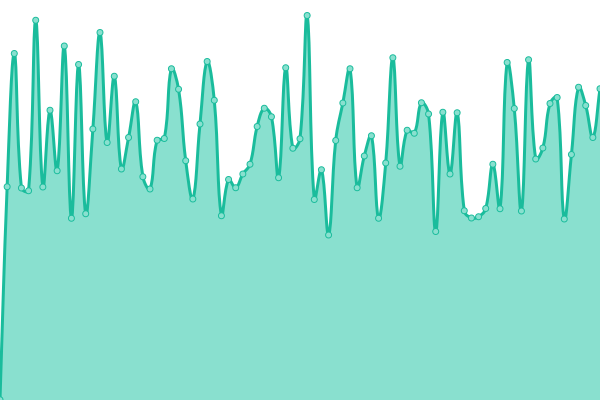

# [📈 Live Status](https://revoltek-daniel.github.io/uptime): <!--live status--> **🟩 All systems operational**

This repository contains the open-source uptime monitor and status page for [Daniel](https://revoltek-daniel.github.io/uptime), powered by [Upptime](https://github.com/upptime/upptime).

With [Upptime](https://upptime.js.org), you can get your own unlimited and free uptime monitor and status page, powered entirely by a GitHub repository. We use [Issues](https://github.com/revoltek-daniel/uptime/issues) as incident reports, [Actions](https://github.com/revoltek-daniel/uptime/actions) as uptime monitors, and [Pages](https://revoltek-daniel.github.io/uptime) for the status page.

<!--start: status pages-->
<!-- This summary is generated by Upptime (https://github.com/upptime/upptime) -->
<!-- Do not edit this manually, your changes will be overwritten -->
<!-- prettier-ignore -->
| URL | Status | History | Response Time | Uptime |
| --- | ------ | ------- | ------------- | ------ |
|  [Phantasialand](https://shop.phantasialand.de) | 🟩 Up | [phantasialand.yml](https://github.com/revoltek-daniel/uptime/commits/HEAD/history/phantasialand.yml) | 

 1185ms
     
 | 

<a href="https://revoltek-daniel.github.io/uptime/history/phantasialand">99.62%</a>
    

|  [Trinkgut](https://www.trinkgut.de) | 🟩 Up | [trinkgut.yml](https://github.com/revoltek-daniel/uptime/commits/HEAD/history/trinkgut.yml) | 

 1056ms
     
 | 

<a href="https://revoltek-daniel.github.io/uptime/history/trinkgut">100.00%</a>
    

|  [Markt](https://mein-markt.trinkgut.de) | 🟩 Up | [markt.yml](https://github.com/revoltek-daniel/uptime/commits/HEAD/history/markt.yml) | 

 651ms
     
 | 

<a href="https://revoltek-daniel.github.io/uptime/history/markt">100.00%</a>
    

|  [BK Trinkgut](https://werbung.trinkgut.de/frontend/mvc/catalog/by-name/10986/newest) | 🟩 Up | [bk-trinkgut.yml](https://github.com/revoltek-daniel/uptime/commits/HEAD/history/bk-trinkgut.yml) | 

 2368ms
     
 | 

<a href="https://revoltek-daniel.github.io/uptime/history/bk-trinkgut">99.94%</a>
    

|  [Audibkk](https://www.audibkk.de) | 🟩 Up | [audibkk.yml](https://github.com/revoltek-daniel/uptime/commits/HEAD/history/audibkk.yml) | 

 1020ms
     
 | 

<a href="https://revoltek-daniel.github.io/uptime/history/audibkk">100.00%</a>
    

<!--end: status pages-->

[**Visit our status website →**](https://revoltek-daniel.github.io/uptime)

## 📄 License

- Powered by: [Upptime](https://github.com/upptime/upptime)
- Code: [MIT](./LICENSE) © [Anand Chowdhary](https://anandchowdhary.com), supported by [Pabio](https://pabio.com)
- Data in the `./history` directory: [Open Database License](https://opendatacommons.org/licenses/odbl/1-0/)
